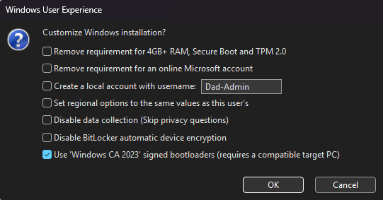
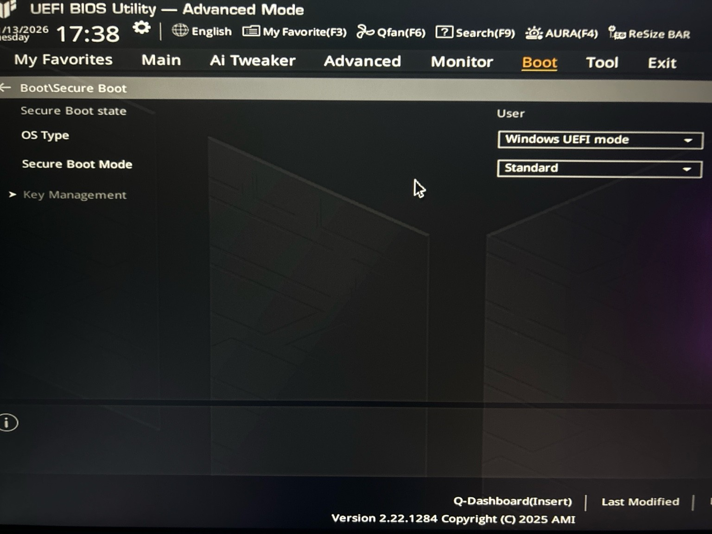
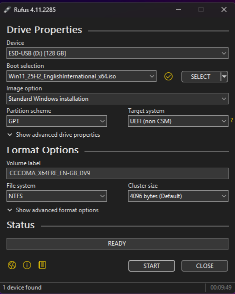
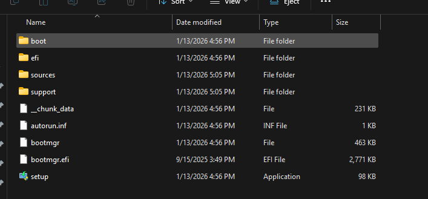
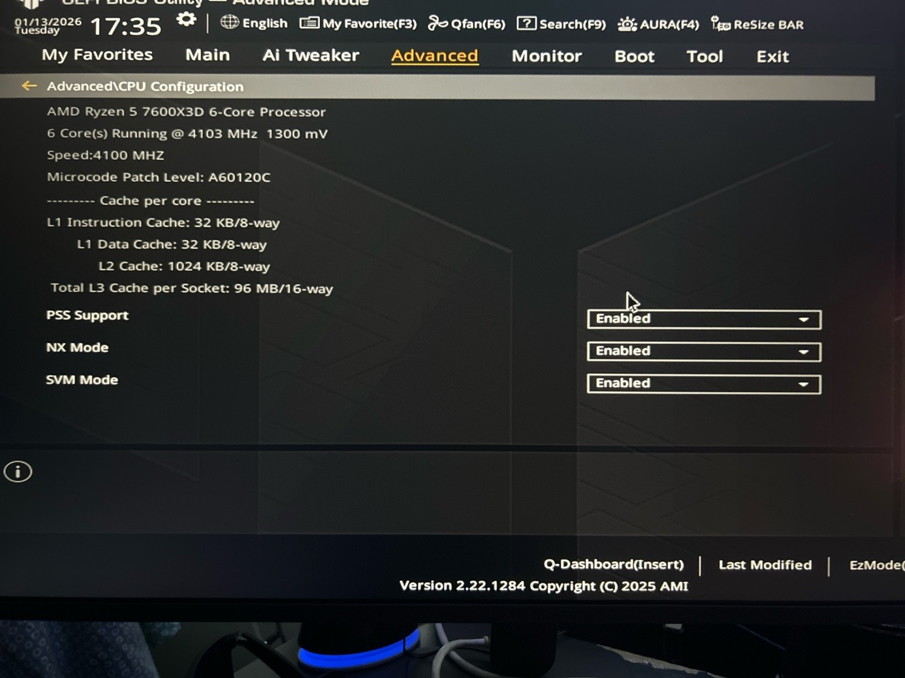
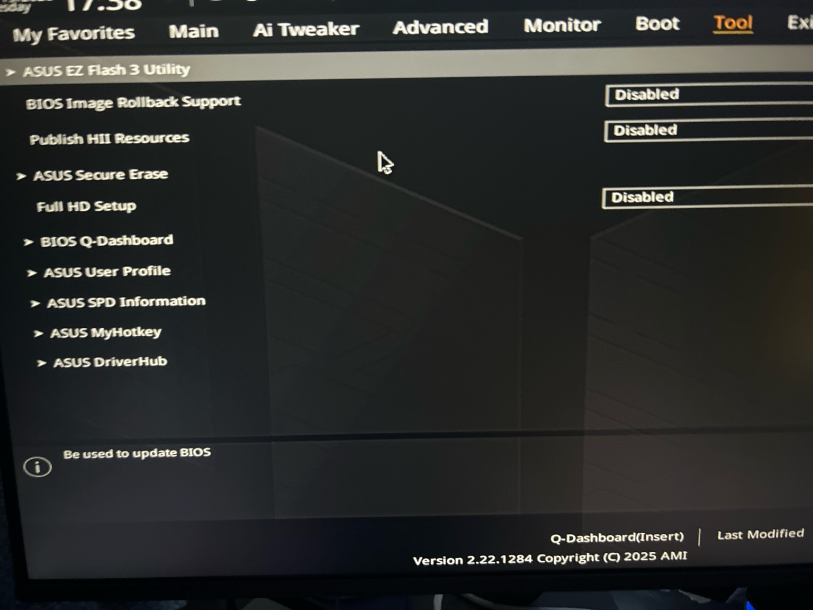

# 🖥️ Lab-002: Windows 11 Secure Deployment Media on Verified UEFI Platform
*(Rufus Lab)*

## 📌 Overview

This project documents the creation of a **Windows 11 secure deployment and recovery USB** using **Rufus** on a **UEFI-based platform**.  
It simulates how enterprise IT teams, government contractors, and regulated environments prepare **trusted boot media** to provision, recover, and secure endpoints.

The goal is not just to install Windows — it is to **establish device trust from firmware to OS**.

The USB created in this lab supports:

- Clean Windows 11 installations  
- Hardware requirement bypass (TPM, Secure Boot, RAM, CPU)  
- UEFI-based boot environments  
- Recovery, repair, and forensic workflows  

This is the same class of tooling used by **help desks, MSPs, hospitals, and government IT teams** when re-imaging or recovering machines in controlled environments.

---

## 🎯 What This Lab Demonstrates

This project proves the ability to:

- Control **OS provenance** (trusted ISO selection)
- Enforce or bypass **hardware trust gates**
- Validate **UEFI firmware boot mode**
- Maintain **chain-of-custody** from USB to installed OS
- Document **secure provisioning evidence**

This aligns directly with **Zero Trust** and **IAM-driven device onboarding**, where a system must prove its integrity before receiving access.

---

## 🧑‍💻 Skills Demonstrated

- Secure OS deployment
- UEFI & firmware validation
- TPM & Secure Boot controls
- Zero Trust device onboarding
- Endpoint chain-of-trust
- Audit-grade technical documentation

---

## 🛡️ Threat Model (Why This Matters)

Modern attackers do not just target Windows — they target the layers *below* it.

This lab defends against:

| Threat | Mitigation |
|-------|------------|
| Bootkits & rootkits | UEFI Secure Boot prevents unsigned bootloaders |
| OS tampering | Verified ISO ensures trusted Windows image |
| Firmware persistence | UEFI validation exposes unsafe boot paths |
| Device spoofing | TPM & CPU security provide hardware identity |
| Rogue re-imaging | Controlled USB enforces deployment integrity |

In Zero Trust environments, a device is not trusted just because it turns on — it must prove:

- Firmware integrity  
- Boot integrity  
- OS integrity  

This lab models that security chain.

---

## 🖼️ Secure Deployment Evidence

| Step | Screenshot | What It Proves |
|------|-----------|----------------|
| ISO Selection |  | Trusted Windows image source |
| Rufus Configuration |  | Controlled provisioning parameters |
| TPM & Secure Boot Bypass |  | Policy override for legacy hardware |
| UEFI Boot Mode |  | Firmware-level boot security |
| Media Ready |  | Deployment chain-of-custody |
| USB File Structure |  | Boot integrity and OS layout |
| CPU Security |  | Hardware root of trust |
| Firmware Tools |  | Platform security controls |

---

## 🔐 IAM & Zero Trust Relevance

This lab reflects how **enterprise identity systems** decide whether a device is allowed to authenticate.

Before a user logs in, modern IAM systems check:

- Is this device real?  
- Is it booting from trusted firmware?  
- Is the OS known and untampered?  

This USB establishes that trust **before Windows even loads**.

That is foundational to:
- Microsoft Entra ID device trust  
- Conditional Access  
- Government and contractor endpoint compliance  

---

## 🧪 Lab Summary

This project demonstrates the ability to:

- Create secure, enterprise-grade deployment media  
- Control and validate hardware trust boundaries  
- Provision systems in Zero Trust environments  
- Produce audit-ready documentation of device integrity  

This is not a hobby install — this is **professional endpoint provisioning**.

---

## 🏁 Conclusion

By combining **UEFI**, **TPM**, **Rufus**, and **controlled Windows images**, this lab models how secure organizations build trust into their machines **from the first boot forward**.

This is the foundation of:
- Secure IT operations  
- Government IT  
- SOC and IAM-driven environments  
